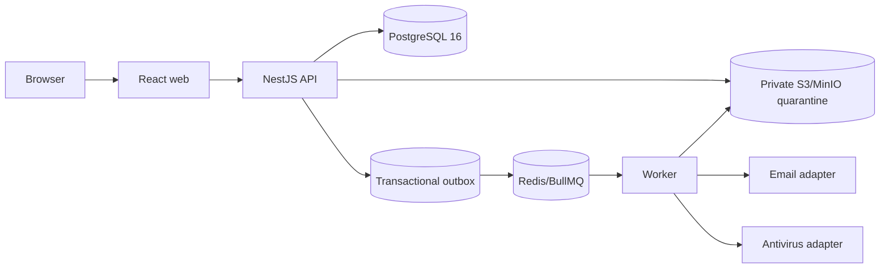

# Container diagram

```mermaid
flowchart LR
  B[Browser] --> W[React web]
  W --> A[NestJS API]
  A --> P[(PostgreSQL 16)]
  A --> S[(Private S3/MinIO quarantine)]
  A --> O[(Transactional outbox)]
  O --> R[(Redis/BullMQ)] --> K[Worker]
  K --> S
  K --> E[Email adapter]
  K --> V[Antivirus adapter]
```

API and worker are separate processes from one modular-monolith codebase. Providers are never called while a business transaction is open.
