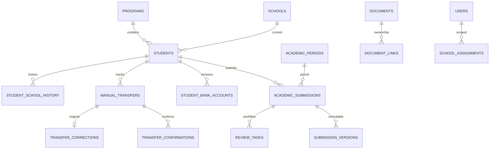

# Physical ERD

```mermaid
erDiagram
 PROGRAMS ||--o{ STUDENTS : contains
 SCHOOLS ||--o{ STUDENTS : current
 STUDENTS ||--o{ STUDENT_SCHOOL_HISTORY : history
 STUDENTS ||--o{ ACADEMIC_SUBMISSIONS : submits
 ACADEMIC_PERIODS ||--o{ ACADEMIC_SUBMISSIONS : period
 ACADEMIC_SUBMISSIONS ||--o{ SUBMISSION_VERSIONS : immutable
 ACADEMIC_SUBMISSIONS ||--o{ REVIEW_TASKS : workflow
 STUDENTS ||--o{ STUDENT_BANK_ACCOUNTS : versions
 STUDENTS ||--o{ MANUAL_TRANSFERS : tracks
 MANUAL_TRANSFERS ||--o{ TRANSFER_CONFIRMATIONS : confirms
 MANUAL_TRANSFERS ||--o| TRANSFER_CORRECTIONS : original
 DOCUMENTS ||--o{ DOCUMENT_LINKS : ownership
 USERS ||--o{ SCHOOL_ASSIGNMENTS : scoped
```

Physical constraints are defined in `infra/docker/postgres/001_baseline.sql` and `002_mvp.sql`.
